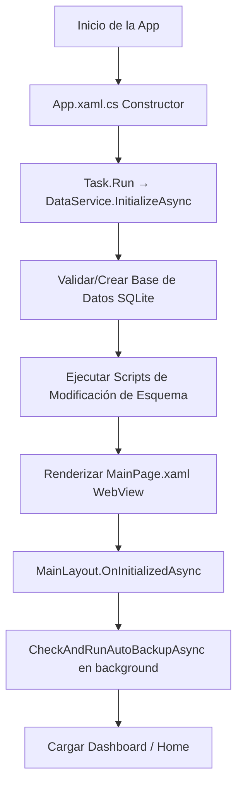
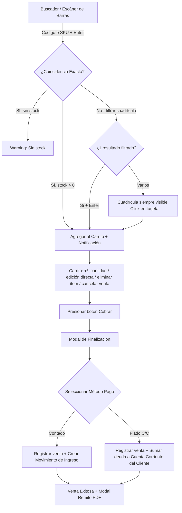

# Sistema de Stock (BASSO TECH) — Documento de Flujos de Extremo a Extremo

Este documento detalla todos los flujos de negocio, lógica y procesos técnicos del sistema **SistemaDeStockV3** (también denominado bajo la marca corporativa **BASSO TECH**). El sistema está construido sobre **.NET 8 MAUI + Blazor Hybrid**, usando componentes Razor y estilizado con **Tailwind CSS v4** (paleta corporativa Navy, con soporte nativo de Modo Oscuro). Los datos se guardan de forma local en una base de datos **SQLite** mediante **EF Core**.

---

## 1. Arquitectura y Fundamentos del Sistema

### 1.1 Persistencia de Datos Local
* **Base de Datos**: Archivo SQLite único localizado en `FileSystem.AppDataDirectory/stock.db` del dispositivo de ejecución (Windows o Android).
* **Gestión de Esquema (Sin Migraciones)**:
  * El sistema no utiliza migraciones de EF Core tradicionales. El esquema se valida en cada inicio en `StockDbContext.InitializeDatabaseAsync()`.
  * La creación inicial de tablas se realiza mediante `EnsureCreatedAsync()`.
  * Los cambios posteriores de esquema se inyectan como scripts SQL manuales, validando previamente la presencia de las columnas mediante consultas `PRAGMA table_info(...)` para evitar excepciones.
  * Los campos de tipo `decimal` (precios, costos, balances) se almacenan de manera explícita como `TEXT` en SQLite para evitar problemas de precisión en coma flotante (configurados con `.HasColumnType("TEXT")` en `OnModelCreating`).

### 1.2 Mecanismo de Soft Delete
* Las entidades críticas (`Producto`, `Cliente`, `Venta`, `Presupuesto`) implementan un campo booleano `IsDeleted`.
* Un filtro global en EF Core descarta automáticamente los registros marcados como eliminados en la mayoría de las consultas.
* Cuando es necesario forzar la recuperación o modificación de un elemento eliminado (por ejemplo, para validaciones internas), se utiliza `.IgnoreQueryFilters()`.

### 1.3 Sistema de Notificaciones Toast
* **Servicio Singleton (`NotificationService`)**: Expone un evento `OnNotify` al que se suscriben los componentes de UI.
* **Cuatro niveles**: `Success` (verde), `Error` (rojo), `Warning` (amarillo), `Info` (azul).
* El componente `ToastContainer.razor` renderiza los mensajes de forma superpuesta y los descarta automáticamente tras **4 segundos** (`Task.Delay(4000)`).
* Se invoca desde cualquier capa (Services, Pages, Shared) inyectando el servicio.

### 1.4 Componentes Compartidos Reutilizables
* **`AppModal.razor`**: Modal genérico con overlay que encapsula el slot de contenido y título. Recibe `IsOpen` e `IsOpenChanged` como parámetros (two-way binding). La visibilidad se controla por clases CSS (`visible`/`invisible`), no por renderizado condicional — el slot de contenido siempre se renderiza en el DOM aunque el modal esté cerrado.
* **`AppPagination.razor`**: Componente de paginación reutilizable. Muestra una ventana deslizante de hasta 5 páginas numeradas alrededor de la página actual (`CurrentPage ± 2`), controles anterior/siguiente, el rango de ítems visible ("Mostrando X a Y de Z resultados") y navegación directa a cualquier página via `GoToPage()`.
* **`GlobalSearchModal.razor`**: Buscador global lanzado con `Ctrl+K` (el atajo está registrado en `MainLayout.razor`, no en el componente). Realiza búsquedas de productos con debounce de 500 ms contra `Data.GetProductosPaginadosAsync`. Muestra hasta 5 resultados con SKU, stock y precio. Al seleccionar un resultado navega a `/productos` (sin abrir el producto específico). `Esc` cierra el modal. Los íconos `↑`/`↓`/`Enter` del footer son decorativos — la navegación por teclado entre resultados no está implementada.
* **`DashboardChart.razor`**: Componente de gráfico para el Dashboard. Renderiza un elemento `<canvas>` y delega el dibujo a **Chart.js** vía `JSRuntime` (`appUI.initChart`). No usa SVG generado en Razor.
* **`BarcodeScanner.razor`**: Componente que encapsula el acceso a la cámara para decodificación de códigos de barras en dispositivos móviles.

### 1.5 Modelo de Datos — Campos Adicionales Relevantes
* **`Producto`**: Incluye `UnidadMedida` (por defecto `"u."`), `Ubicacion` (texto libre de hasta 100 caracteres para referencia física en el local) y `CodigoBarras` (string nullable, máximo 50 caracteres, agregado via script SQL manual al esquema).
* **`ConfiguracionApp`**: Además de los datos del negocio, incluye umbrales configurables para el análisis de rotación de inventario: `UmbralRotacionBaja` (defecto: 1.0), `UmbralRotacionMedia` (defecto: 4.0) y `DiasAlertaSinVenta` (defecto: 90 días).

---

## 2. Flujo de Inicialización y Ciclo de Vida del Sistema

Al abrir la aplicación, se desencadenan los siguientes pasos técnicos en segundo plano:

1. **Inicialización Sincrónica Segura**: En el constructor de `App.xaml.cs` se usa `Task.Run(async () => await dataService.InitializeAsync()).GetAwaiter().GetResult()`. El `Task.Run` mueve la ejecución al thread pool para evitar deadlock; el hilo principal espera su resultado bloqueado antes de continuar con el render del WebView.
2. **Chequeo de Respaldos Automáticos**: Una vez que el layout Blazor se inicializa (`MainLayout.OnInitializedAsync`), se lanza `BackupService.CheckAndRunAutoBackupAsync()` en segundo plano (`Task.Run`). El método verifica dos condiciones: (a) que haya una carpeta destino configurada en `Preferences` y que exista en disco; (b) que hayan transcurrido más de 24 horas desde el último backup registrado. Solo si ambas condiciones se cumplen se copia silenciosamente el archivo `.db` a la carpeta destino.

---

## 3. Flujos de los Módulos de la Aplicación

### 3.1 Dashboard / Panel Principal (`Home.razor`)
El usuario ingresa al Dashboard, que actúa como el centro operativo y de monitoreo de negocio en tiempo real.

* **KPIs Visuales en Tiempo Real**:
  * **Ventas del Día**: Suma total monetaria y cantidad de transacciones del día calendario actual.
  * **Deuda Clientes**: Suma agregada de los balances de las cuentas corrientes de los clientes (Capital a cobrar).
  * **Valor de Inventario**: Sumatoria del valor estimado del stock físico disponible calculado a precio público (`Stock * Price`).
  * **Productos totales y Alertas**: Muestra el total de productos y un indicador de stock. Si hay productos por debajo de su stock mínimo, el badge cambia a semáforo de alerta rojo/amarillo; si todo está correcto, se muestra en verde como "Stock saludable".
* **Acciones de Acceso Rápido**:
  * Botones flotantes para iniciar una **Nueva Venta**, crear un **Nuevo Producto** o registrar un **Gasto Manual** en caja.
  * **Evolución de Ingresos**: Gráfico integrado que muestra las ventas de los últimos 7 días con tasas porcentuales de crecimiento.
  * **Top 5 de Baja Rotación**: Panel dinámico que detecta los productos prioritarios para liquidar debido a su nula o baja rotación anual.
  * **Alertas de Stock**: Tabla con scroll dedicada a listar los productos cuyo stock actual es menor o igual a su stock mínimo.
  * **Actividad Reciente**: Listado cronológico de los últimos 10 movimientos financieros registrados en la caja (ventas, pagos, gastos).
  * **Buscador Global**: Activado mediante clic o atajo de teclado (`Ctrl+K`), abriendo un modal de búsqueda global.

---

### 3.2 Punto de Venta (POS) / Registro de Ventas (`PuntoDeVenta.razor`)
Permite registrar transacciones de venta rápida con soporte de lectura de código de barras físico.

* **Flujo de Carga de Productos**:
  * El cursor se auto-enfoca en el buscador al cargar la página.
  * **Lectura por Escáner**: Al escanear un código de barras o ingresar un SKU y presionar `Enter`, la vista evalúa coincidencias. Si coincide exactamente con un producto con stock disponible, lo añade de inmediato al carrito y dispara una notificación Success. Si la coincidencia existe pero tiene stock 0, emite una notificación Warning (`"Sin stock: {nombre}"`). Si no hay coincidencia exacta y la búsqueda filtrada arroja un único resultado, presionar `Enter` también lo añade.
  * **Selección Manual**: La cuadrícula de tarjetas de productos es **siempre visible** (no aparece solo después de un Enter fallido). Muestra stock actual, SKU, precio y un botón rápido de agregar. Los productos sin stock se muestran atenuados y con clic bloqueado.
* **Lógica del Carrito de Compras**:
  * Modificación de cantidades mediante controles incrementales (`+` / `-`).
  * **Edición Directa**: El usuario puede digitar cantidades directamente en el input numérico (útil para compras grandes).
  * **Validación de stock triple**: el límite de stock se aplica en los tres puntos de modificación: al agregar un ítem nuevo (`AddToCart`), al usar `+` incremental (`UpdateQuantity`) y al editar directamente el input (`SetQuantity`). Si se ingresa un número mayor al stock disponible, se clampea al máximo y se emite un Warning.
  * **Gestión del carrito**: cada ítem tiene un botón de eliminar (trash). Un botón "Cancelar Venta" limpia todo el carrito.
* **Proceso de Cobro (Checkout Modal)**:
  * **Identificación del Cliente**: Opción de seleccionar un cliente registrado (por defecto "Consumidor Final").
  * **Método de Pago**:
    * **Contado**: Genera un cobro regular. Al confirmar, se crea automáticamente un `MovimientoFinanciero` de tipo **Ingreso** asociado a la venta.
    * **Fiado (Cuenta Corriente)**: Esta opción solo se habilita si se ha seleccionado un cliente (no Consumidor Final). Al confirmar, no se crea movimiento de caja inmediato, sino que se incrementa el saldo deudor (`Balance`) en la `CuentaCorriente` del cliente.
  * **Descuento**: Se puede aplicar un descuento de forma porcentual (`%`) o un monto fijo (`$`). El total final se recalcula dinámicamente. El descuento `%` se limita a `[0, 100]` con `Math.Clamp`; el descuento `$` se limita a `[0, CartTotal]` (no puede superar el total de la venta).
  * **Transaccionalidad**: El procesamiento de la venta se realiza dentro de una transacción de base de datos de EF Core (`BeginTransactionAsync`). Si cualquier operación interna falla (FindAsync, chequeo de stock, inserción), la transacción se revierte (`RollbackAsync`) para garantizar consistencia. Nota: SQLite en modo archivo local no soporta locking a nivel de fila para escenarios multi-terminal concurrentes.
* **Finalización y Remito**:
  * Tras un cobro exitoso, se abre un modal que ofrece imprimir un **Remito PDF** mediante QuestPDF, el cual se guarda localmente usando la interfaz nativa `FileSaver`.
  * El PDF remito es de tamaño **A5** e incluye: encabezado con datos del negocio; bloque de datos del cliente (nombre, teléfono, dirección, CUIT) con badge **"FIADO"** en rojo si aplica; tabla de ítems (cantidad, descripción, precio unitario, subtotal); sección de descuento desglosado si el total cobrado difiere del subtotal de ítems; total final con etiqueta `"TOTAL (Contado)"` o `"TOTAL (Cuenta Corriente)"`; bloque de firma y aclaración al pie; footer con fecha/hora de generación.

---

### 3.3 Gestión de Clientes y Cuentas Corrientes (`Clientes.razor`)
Administración de la cartera de clientes e historial de deudas.

* **Fichas de Clientes**:
  * Almacena datos comerciales como CUIT, Email, Dirección, Teléfono y Condición de IVA (Monotributista, Responsable Inscripto, Consumidor Final, etc.).
  * **Integración con WhatsApp**: Si el cliente tiene un número telefónico cargado, se muestra un botón para abrir un chat directo mediante la URL `wa.me/`. El sistema limpia caracteres no numéricos y agrega el prefijo `54` (Argentina) solo si el número no empieza ya con `54` ni con `1`.
* **Estado de Cuenta Corriente**:
  * Cada cliente tiene una cuenta corriente asociada con un `Balance`. Los saldos deudores (`Balance > 0`) se resaltan en rojo con la leyenda "Deuda pendiente". Los saldos a favor (`Balance < 0`) se muestran en verde, aunque la etiqueta textual "A FAVOR" solo aparece en el PDF del estado de cuenta, no en la tarjeta de la UI.
  * **Saldar Deuda**: Permite registrar un cobro parcial o total de la deuda. El flujo reduce el `Balance` de la cuenta corriente y genera automáticamente un `MovimientoFinanciero` de tipo **Ingreso** por cobro en la caja general.
  * **Ver Detalle**: Abre un modal con el desglose cronológico de todas las compras fiadas del cliente y los productos que integraron cada venta.
  * **Exportar Estado de Cuenta**: Accesible desde dentro del modal **"Ver Detalle"** (no hay acceso directo desde la tarjeta del cliente). Genera un PDF A4 mediante `PdfService.GenerarEstadoCuenta` que incluye: membrete comercial (nombre, dirección, teléfono del negocio); datos del cliente (nombre, teléfono, dirección, CUIT, email); saldo consolidado con etiqueta de estado (`DEUDA PENDIENTE` / `A FAVOR` / `SIN DEUDA`); tabla cronológica de ventas fiadas (orden descendente por fecha) con detalle de ítems por venta; total de deuda; nota de no validez fiscal; y paginación en el footer.

---

### 3.4 Gestión de Inventario (`Productos.razor`)
Control centralizado de mercadería, precios de costo y márgenes de ganancia.

* **Catálogo Técnico**:
  * Muestra SKU, nombre, categoría, ubicación física y stock con indicadores visuales de salud (Stock bajo, sin stock o saludable).
  * **Ajuste de Stock Rápido**: Botones directos `+` y `-` en la misma tabla del catálogo para corregir desvíos de stock sin necesidad de abrir modales de edición.
  * **Buscador de Edición Rápida**: Si se escanea un código de barras en esta pantalla, el sistema abre directamente el modal de edición del producto correspondiente.
* **Modal de Creación y Edición**:
  * **Cálculo de Precios Automatizado**:
    * Al modificar el **Precio de Costo** o el **Margen de Ganancia (%)**, el sistema calcula de forma automática el **Precio de Venta**.
    * Al modificar manualmente el **Precio de Venta**, se recalcula el **Margen de Ganancia (%)** en relación al costo.
  * Admite códigos de barras y ubicaciones personalizadas (ej. *Estantería 3, Pasillo A*).
* **Ajuste Masivo de Precios (Variación Porcentual)**:
  * El usuario puede filtrar productos por categoría o término de búsqueda, seleccionarlos individualmente o de forma masiva, y aplicarles un incremento o reducción porcentual.
  * El modal muestra en tiempo real una simulación del precio resultante para cada producto seleccionado antes de confirmar la operación.
  * Cada cambio de precio genera un registro en la tabla `HistorialPrecio`.
* **Eliminación Múltiple**:
  * Permite la depuración masiva de productos mediante filtros avanzados y casillas de selección.
* **Importación desde Excel**:
  * El usuario selecciona un archivo `.xlsx`.
  * Se asigna una categoría por defecto para los productos nuevos.
  * **Lógica de Importación**: El sistema detecta primero las columnas por sus **encabezados** (busca variantes como `sku`/`cod`, `nombre`/`producto`/`descrip`, `precio`/`price`/`costo`/`valor`). Solo si el archivo no tiene encabezados reconocibles usa el orden por defecto: *SKU (Columna A)*, *Nombre (Columna B)*, *Precio (Columna C)*. Si el SKU ya existe, actualiza nombre y precio (registrando el cambio en `HistorialPrecio` si el precio varió); de lo contrario crea el producto con stock inicial de 5 unidades. Se emite un informe final detallando productos nuevos creados, actualizados y errores de fila.

---

### 3.5 Análisis de Rotación e Historial de Precios (`VariacionPrecios.razor`)
Monitoreo inteligente del rendimiento del inventario y auditoría de variaciones.

* **Análisis de Rotación Anual (Fórmula de Negocio)**:
  * El sistema calcula el índice de rotación anual: $\text{Rotación} = \frac{\text{Unidades Vendidas en 12 Meses}}{\text{Stock Actual}}$.
  * Determina estados de rotación semánticos: **Alta** (se vende y repone constantemente), **Media**, **Baja** (capital inmovilizado) o **Sin rotación**. Los umbrales son configurables en `ConfiguracionApp` (`UmbralRotacionBaja` = 1.0, `UmbralRotacionMedia` = 4.0 por defecto).
  * El DTO `RotacionProductoDto` incluye campos adicionales: **Tendencia** (indicador visual ↑/→/↓ según evolución reciente), **MargenUnitario** (porcentaje de ganancia), **ValorInmovilizado** (`Stock × PrecioCosto`) y **DiasSinVenta** (días transcurridos desde la última venta registrada). Si no hay ventas históricas para un producto, `DiasSinVenta` refleja cuántos días llevan sin moverse desde que fueron cargados.
  * Recomienda acciones comerciales inmediatas: *Descontinuar/limpiar stock*, *Promocionar o ajustar precio* o *Mantener*.
  * Permite exportar estas métricas a un documento Excel (12 columnas) donde las filas se colorean automáticamente según el nivel de riesgo: verde (Alta), azul (Media), amarillo (Baja), rojo (Sin rotación).
* **Historial de Variación de Precios**:
  * Bitácora de auditoría que registra la fecha del cambio, el producto afectado, el precio anterior, el nuevo precio y el porcentaje neto de la variación (con indicadores de subida y bajada).
  * Incluye un buscador que filtra por nombre de producto o por fecha en formato `dd/MM/yyyy`.

---

### 3.6 Presupuestos (`Presupuestos.razor`)
Generación de cotizaciones formales para clientes sin afectar el stock real.

* **Creación de Presupuestos**:
  * Interfaz de pantalla dividida: a la izquierda el catálogo de productos con buscador rápido; a la derecha, la planilla del presupuesto.
  * Admite fecha de validez (vencimiento), cliente destinatario y observaciones libres.
  * Permite sumar ítems, definir cantidades e incrementar o disminuir el volumen.
* **Descarga en PDF**:
  * Al guardar, se genera automáticamente un presupuesto formal A4 PDF vía QuestPDF y se abre el diálogo de guardado nativo.
  * Los presupuestos ya guardados pueden reimprimirse desde la tabla de lista con un botón dedicado de descarga.
  * El PDF incluye: datos del negocio, número de presupuesto, fecha; bloque de validez (si tiene `FechaVencimiento`); datos del cliente destinatario; tabla de ítems con subtotales; total; sección **OBSERVACIONES** con el contenido del campo `Notas` (si no está vacío); cláusulas de no validez fiscal.
  * Si un presupuesto listado ha superado su fecha de vencimiento, la tabla de control lo resalta en rojo con la leyenda `(vencido)`.

---

### 3.7 Lector de Códigos por Cámara (`Scanner.razor`)
Módulo diseñado para dispositivos móviles y terminales con cámara integrada.

* **Flujo de Escaneo Activo**:
  * Levanta el stream de video a través de la cámara trasera y analiza cuadros para decodificar simbologías comunes (EAN-13, QR, etc.).
* **Flujo de Producto Encontrado**:
  * Muestra una ficha del producto con: nombre, SKU, categoría, stock (con badge de color por salud), stock mínimo, precio de venta, costo (solo si `PrecioCosto > 0`) y ubicación (solo si no está vacía).
  * **Agregar al POS**: navega a `/ventas?scan={codigoBarras}`, delegando al POS la lógica de agregar al carrito via query string.
  * **Editar producto**: navega a `/productos` (sin abrir el modal del producto específico automáticamente).
* **Flujo de Código No Registrado**:
  * Si el código leído no figura en la base de datos, el sistema interrumpe el flujo y ofrece dos alternativas:
    1. **Asignar a producto existente**: Muestra un buscador inline (vacío por defecto, filtra al tipear). Al seleccionar un producto, vincula el código escaneado al registro mediante `Data.AsignarCodigoBarrasAsync()`.
    2. **Crear producto nuevo**: Muestra un formulario completo **inline dentro de `Scanner.razor`** (no redirige). El código de barras escaneado se pre-carga y se muestra como texto de solo lectura (no como `<input disabled>`).
  * En ambos casos, al completar la acción el sistema transiciona automáticamente al modo **Encontrado**, mostrando la ficha del producto recién vinculado o creado.
* **Entrada manual de código**: Además del escaneo por cámara, existe un campo de texto + botón "Buscar" para ingresar códigos manualmente (con soporte de `Enter`), útil como fallback cuando la cámara no puede leer el código.

---

### 3.8 Caja y Finanzas (`Finanzas.razor`)
Libro de caja diario para el control del flujo de efectivo.

* **Registro de Movimientos**:
  * Los movimientos asociados a ventas de contado se crean de forma automática.
  * Los cobros de cuentas corrientes de clientes también se asocian de manera automática.
  * Permite registrar ingresos y egresos manuales (pago de servicios, aportes de caja, retiros, compras a proveedores) ingresando el concepto y el monto.
* **Panel de KPIs**: Muestra tres tarjetas de resumen histórico acumulado: **Total Ingresos**, **Total Egresos** y **Balance Neto** (Ingresos − Egresos). Los tres son históricos sin filtro de fecha.
* **Buscador**: Filtro de texto con debounce de 400 ms que filtra la lista de movimientos por concepto/descripción.
* **Columna Referencia**: La tabla indica si cada movimiento está vinculado a una venta mostrando `"Venta Ref."` (cuando `VentaId` tiene valor) o `"—"` para movimientos manuales.

---

### 3.9 Reportes y Exportación (`Reportes.razor`)
Módulo centralizado para exportación de datos y auditoría de facturación.

* **Exportaciones de Hojas de Cálculo (Excel)**:
  * **Inventario**: Columnas: SKU, Producto, Categoría, Precio (venta), Stock, Valor Total ARS (`Stock × Precio de venta`). Marca en rojo la **celda de stock** (fuente roja) para ítems con stock ≤ stock mínimo. No incluye columna de Ubicación.
  * **Ventas**: Columnas: Nro. Venta, Fecha y Hora, Cliente, Tipo Pago (Contado / Fiado C/C), Total ARS. Con fila de total de ventas al pie usando fórmula Excel.
  * **Finanzas**: Libro diario de ingresos y egresos con cálculo automático del balance neto.
* **Reimpresión de Remitos**:
  * Tabla paginada (15 ítems por página, usando `AppPagination`) con:
    * Buscador de texto libre por número de venta o nombre de cliente.
    * Selector de rango de fecha: "Todo el historial", "Última Semana" o "Último Mes".
  * Cada fila muestra número, fecha, cliente, tipo (badge **Contado** / **Fiado C/C**) y total.
  * Permite volver a generar y descargar el comprobante PDF de cualquier venta histórica.

---

### 3.10 Configuración y Respaldos (`Configuracion.razor`)

* **Datos de la Empresa**: Permite modificar el nombre de la empresa, dirección, teléfono y símbolo monetario principal (por defecto `ARS`), los cuales impactan en el diseño de los PDFs generados.
* **Configuración de Copias de Seguridad**:
  * **Destino de Respaldos**: Mediante el selector de carpetas nativo del sistema operativo (`FolderPicker`), se define el directorio de destino. Se recomienda una carpeta sincronizada con Google Drive Desktop para resguardo en la nube.
  * Hay **dos tipos de respaldo**:
    1. **Backup Histórico** (`Backup_Stock_yyyyMMdd_HHmm.db`): Generado manual o automáticamente. Mantiene una retención máxima de 15 archivos; los más antiguos se eliminan automáticamente.
    2. **Backup de Cierre** (`Backup_Stock_UltimoCierre.db`): Nombre fijo que se sobreescribe en cada cierre de sesión. Se invoca desde `BackupService.ExecuteClosingBackupAsync` y registra su fecha en `Preferences` con la clave `Backup.LastCloseUtc`. La pantalla muestra por separado la fecha del último backup histórico y la del último backup de cierre.
  * **Respaldar Ahora**: Genera un Backup Histórico inmediatamente y actualiza la fecha en pantalla.
  * **Restaurar**: `BackupService.RestoreBackupAsync()` solicita un archivo `.db`, `.sqlite` o `.sqlite3` via selector nativo, cierra las conexiones SQLite (`SqliteConnection.ClearAllPools()`), llama a `GC.Collect()` + `GC.WaitForPendingFinalizers()` para liberar handles de archivo pendientes, y sobreescribe el archivo `.db` activo. Una vez que el servicio retorna éxito, la capa UI (`Configuracion.razor`) espera 3 segundos y ejecuta `Application.Current?.Quit()` para que los nuevos datos se carguen en memoria al reabrir.
  * **Nota técnica**: `BackupService` también expone `ExportBackupAsync()`, que abre el diálogo nativo de "Guardar archivo" (`FileSaver.Default.SaveAsync`) para exportar la DB directamente a cualquier destino elegido por el usuario. Este método existe en el servicio pero actualmente no tiene botón en la UI de Configuración.
### 3.11 Gestión de Categorías (`Categorias.razor`)
Administración del catálogo de familias de productos para organización del inventario.

* **Listado en Cuadrícula**: Muestra todas las categorías en tarjetas de grilla responsiva (1 → 3 → 4 columnas). Las acciones (ver, editar, eliminar) aparecen con efecto hover sobre cada tarjeta.
* **Creación / Edición**: Modal unificado con validación de nombre requerido (máximo 100 caracteres). Operaciones guardadas vía `Data.SaveCategoriaAsync`.
* **Eliminación con Confirmación**: Modal de confirmación doble con advertencia irreversible antes de invocar `Data.DeleteCategoriaAsync`.
* **Vista de Productos por Categoría**: Al presionar el ícono de ojo en una tarjeta, abre un modal con la lista de productos de esa categoría. El modal tiene tres estados: **cargando** (spinner animado mientras se resuelve la consulta), **vacío** (mensaje si la categoría no tiene productos) y **tabla** (Nombre, SKU, Stock en rojo si ≤ stock mínimo, Precio). La cantidad de resultados se indica en el encabezado.

